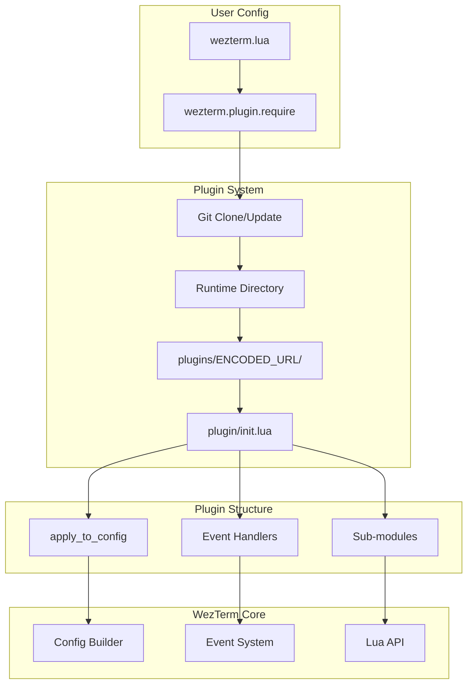

# WezTerm Plugin Development Research Document

> Generated: Thu Jan 08 2026
> Scope: Comprehensive research on WezTerm plugin system, development patterns, and ecosystem
> Research depth: Official documentation, utility libraries, popular plugin analysis, source code review

## Executive Summary

- WezTerm plugins are Lua packages distributed via Git URLs, with a required `plugin/init.lua` entry point that exports an `apply_to_config` function
- Plugins are cloned into WezTerm's runtime directory under `plugins/NAME` (encoded from URL) and must manually update `package.path` to require sub-modules
- The ecosystem has mature utility libraries (`lib.wezterm`, `dev.wezterm`, `listeners.wezterm`) for common development needs
- Popular plugins demonstrate patterns: configuration merging, event-based architecture, theme integration, and cross-platform compatibility
- Type safety can be achieved using `wezterm-types` (LuaCATS annotations) for IDE support

---

## 1. System Overview

### 1.1 Purpose & Context

WezTerm is a powerful cross-platform terminal emulator written in Rust by [@wez](https://github.com/wez). The plugin system enables users to extend WezTerm's functionality through Lua packages distributed via Git repositories.

**Use cases for plugins:**
- Custom tab bar styling (tabline.wez, bar.wezterm)
- Session/workspace management (resurrect.wezterm, smart_workspace_switcher)
- Keybinding enhancement (modal.wezterm, wez-tmux)
- UI customization (presentation.wez, themes)
- Integration with external tools (AI helpers, Neovim)

### 1.2 High-Level Architecture



### 1.3 Technology Stack

| Layer | Technology | Version | Purpose |
|-------|------------|---------|---------|
| Runtime | Lua 5.4 | Embedded | Plugin scripting |
| Terminal | WezTerm | 20240203+ | Host application |
| Distribution | Git | Any | Plugin delivery |
| Types (Optional) | wezterm-types | 1.2.0 | LuaCATS annotations |

---

## 2. Plugin Structure

### 2.1 Directory Layout

```
my-plugin.wezterm/
├── plugin/
│   └── init.lua          # Required entry point
│   └── module1.lua       # Optional sub-modules
│   └── module2.lua
├── examples/             # Optional examples
├── .luarc.json          # Optional LSP config
├── .stylua.toml         # Optional formatter config
├── LICENSE              # Recommended
└── README.md            # Documentation
```

### 2.2 Key Files & Entry Points

| File | Purpose | Key Exports |
|------|---------|-------------|
| `plugin/init.lua` | Main entry point | `apply_to_config(config, opts?)`, module table |
| `.luarc.json` | Lua Language Server config | Type checking settings |
| `.stylua.toml` | StyLua formatter config | Code style rules |

### 2.3 Minimal Plugin Template

```lua
-- plugin/init.lua
local wezterm = require('wezterm')

local M = {}

--- Apply plugin configuration to WezTerm config
---@param config table WezTerm config builder
---@param opts? table Optional plugin configuration
function M.apply_to_config(config, opts)
    -- Merge user options with defaults
    opts = opts or {}
    
    -- Apply configuration changes
    config.some_setting = opts.some_setting or "default"
end

return M
```

---

## 3. Core Concepts

### 3.1 Plugin Installation

Plugins are installed via `wezterm.plugin.require()`:

```lua
local wezterm = require('wezterm')
local my_plugin = wezterm.plugin.require('https://github.com/owner/repo')

local config = wezterm.config_builder()
my_plugin.apply_to_config(config)

return config
```

**Supported URL Protocols:**
- `https://` - Standard GitHub/GitLab URLs
- `file:///` - Local development (e.g., `file:///home/user/projects/my-plugin`)

### 3.2 Plugin Location & Runtime Directory

Plugins are cloned to WezTerm's runtime directory:

```
~/.local/share/wezterm/plugins/  (Linux)
~/Library/Application Support/wezterm/plugins/  (macOS)
%APPDATA%\wezterm\plugins\  (Windows)
```

The folder name is an encoded version of the URL:
```
httpssCssZssZsgithubsDscomsZsownersZsrepo
```

### 3.3 Managing Sub-modules

Requiring sub-modules requires updating `package.path`. The standard pattern:

```lua
local wezterm = require('wezterm')

local M = {}

-- Determine platform-specific separator
local is_windows = string.match(wezterm.target_triple, 'windows') ~= nil
local separator = is_windows and '\\' or '/'

-- Get plugin directory from plugin list
local plugin_dir = wezterm.plugin.list()[1].plugin_dir:gsub(separator .. '[^' .. separator .. ']*$', '')

-- Helper to check if directory exists
local function directory_exists(path)
    local success, result = pcall(wezterm.read_dir, plugin_dir .. path)
    return success and result
end

-- Determine the encoded path name
local function get_require_path()
    local https_path = 'httpssCssZssZsgithubsDscomsZsownersZsrepo'
    local https_path_slash = 'httpssCssZssZsgithubsDscomsZsownersZsreposZs'
    
    if directory_exists(https_path_slash) then
        return https_path_slash
    end
    return https_path
end

-- Update package.path
package.path = package.path
    .. ';'
    .. plugin_dir
    .. separator
    .. get_require_path()
    .. separator
    .. 'plugin'
    .. separator
    .. '?.lua'

-- Now sub-modules can be required
local submodule = require('my_submodule')

return M
```

### 3.4 Plugin Updates

Plugins are **not** automatically updated. Users must:

```lua
-- In Debug Overlay (Ctrl+Shift+L) or via action:
wezterm.plugin.update_all()
```

Or delete the plugin directory and let WezTerm re-clone on next launch.

---

## 4. Event System

### 4.1 Core Events

WezTerm provides a powerful event system for plugins:

| Event | Trigger | Arguments |
|-------|---------|-----------|
| `update-status` | Periodic (default 1s) | `(window, pane)` |
| `format-tab-title` | Tab title needs update | `(tab, tabs, panes, config, hover, max_width)` |
| `window-resized` | Window size changes | `(window, pane)` |
| `gui-startup` | GUI initialization | None |
| `augment-command-palette` | Command palette open | `(window, pane)` |

### 4.2 Event Registration

```lua
local wezterm = require('wezterm')

wezterm.on('update-status', function(window, pane)
    -- Set left/right status
    window:set_left_status('Left Status')
    window:set_right_status('Right Status')
end)

wezterm.on('format-tab-title', function(tab, tabs, panes, config, hover, max_width)
    return {
        { Text = ' Tab ' .. tab.tab_index + 1 .. ' ' },
    }
end)
```

### 4.3 Custom Events

Plugins can emit custom events for inter-plugin communication:

```lua
-- Emit an event
wezterm.emit('my_plugin.some_event', window, pane, custom_data)

-- Listen for events
wezterm.on('my_plugin.some_event', function(window, pane, custom_data)
    wezterm.log_info('Event received:', custom_data)
end)
```

**Common event naming pattern:** `plugin_name.category.action`

Examples from popular plugins:
- `resurrect.state_manager.save_state.finished`
- `smart_workspace_switcher.workspace_switcher.created`
- `modal.enter` / `modal.exit`

---

## 5. Configuration Patterns

### 5.1 Options Merging

Standard pattern for handling user options:

```lua
local M = {}

local default_opts = {
    enabled = true,
    color = 'blue',
    modules = {
        feature_a = { enabled = true },
        feature_b = { enabled = false },
    }
}

local function deep_merge(t1, t2)
    local result = {}
    for k, v in pairs(t1) do
        if type(v) == 'table' and type(t2[k]) == 'table' then
            result[k] = deep_merge(v, t2[k])
        elseif t2[k] ~= nil then
            result[k] = t2[k]
        else
            result[k] = v
        end
    end
    for k, v in pairs(t2) do
        if result[k] == nil then
            result[k] = v
        end
    end
    return result
end

function M.apply_to_config(config, opts)
    opts = deep_merge(default_opts, opts or {})
    -- Use merged opts...
end

return M
```

### 5.2 Theme Integration

Reading colors from WezTerm's color scheme:

```lua
function M.apply_to_config(config, opts)
    local scheme = wezterm.color.get_builtin_schemes()[config.color_scheme]
    if scheme then
        -- Access colors
        local bg = scheme.background
        local fg = scheme.foreground
        local ansi = scheme.ansi      -- Array of 8 ANSI colors
        local brights = scheme.brights -- Array of 8 bright colors
        
        -- Use in configuration
        config.colors = config.colors or {}
        config.colors.tab_bar = {
            background = 'transparent',
            active_tab = {
                bg_color = 'transparent',
                fg_color = ansi[5], -- Blue
            },
        }
    end
end
```

### 5.3 Keybinding Configuration

Adding keybindings via plugin:

```lua
function M.apply_to_config(config)
    config.keys = config.keys or {}
    
    table.insert(config.keys, {
        key = 'p',
        mods = 'LEADER',
        action = wezterm.action_callback(function(window, pane)
            -- Custom action
        end),
    })
end

-- Or provide action for user to bind
function M.my_action()
    return wezterm.action_callback(function(window, pane)
        -- Action logic
    end)
end
```

---

## 6. Utility Libraries

### 6.1 lib.wezterm

**Purpose:** Common utility functions for plugin development

**Repository:** https://github.com/ChrisGVE/lib.wezterm

| Module | Functions |
|--------|-----------|
| `string` | `hash()`, `strip_format_esc_seq()`, `utf8len()` |
| `file_io` | `read_file()`, `write_file()`, `ensure_folder_exists()` |
| `table` | `deepcopy()`, `tbl_deep_extend()` |
| `utils` | Platform detection (`is_windows`, `is_mac`, `separator`) |
| `wezterm` | `get_current_window_size()`, `get_current_window_width()` |

**Usage:**
```lua
local lib = wezterm.plugin.require("https://github.com/chrisgve/lib.wezterm")

-- String utilities
local key = lib.string.hash("my-string")

-- File I/O
local success, content = lib.file_io.read_file("/path/to/file")
```

### 6.2 dev.wezterm

**Purpose:** Plugin location resolution for development and deployment

**Repository:** https://github.com/ChrisGVE/dev.wezterm

**Key Features:**
- Returns plugin path after installation
- Adds plugin root to `package.path`
- Consistent error handling with event emissions

**Usage:**
```lua
local dev = wezterm.plugin.require("https://github.com/chrisgve/dev.wezterm")

function M.init()
    local opts = {
        keywords = { "https", "owner", "my_plugin" },
        auto = true,  -- Auto-setup package.path
    }
    local plugin_dir = dev.setup(opts)
    
    -- Now sub-modules can be required
    local module1 = require("module1")
end
```

### 6.3 listeners.wezterm

**Purpose:** Enhanced event listener capabilities with persistent state

**Repository:** https://github.com/ChrisGVE/listeners.wezterm

**Features:**
- Centralized event configuration
- Persistent state management (flags, counters, data, functions)
- Toast notifications

**Usage:**
```lua
local listeners = wezterm.plugin.require('https://github.com/username/listeners.wezterm')

local event_listeners = {
    ["window-resized"] = {
        toast_message = "Window resized to %dx%d",
    },
    ["key-pressed"] = {
        fn = function(args)
            wezterm.log_info("Key pressed!")
        end,
    },
}

listeners.config(event_listeners, { toast_timeout = 2000 })

-- State management
listeners.state.flags.set("dark_mode", true)
listeners.state.counters.increment("windows_opened")
```

---

## 7. Popular Plugin Patterns

### 7.1 Tab Bar Plugins (tabline.wez, bar.wezterm)

**Pattern:** Hook into `format-tab-title` and `update-status` events

```lua
function M.setup(opts)
    require('plugin.config').set(opts)
    
    wezterm.on('update-status', function(window)
        require('plugin.component').set_status(window)
    end)
    
    wezterm.on('format-tab-title', function(tab, _, _, _, hover, _)
        return require('plugin.tabs').set_title(tab, hover)
    end)
end

function M.apply_to_config(config)
    config.use_fancy_tab_bar = false
    config.show_new_tab_button_in_tab_bar = false
    config.tab_max_width = 32
    config.status_update_interval = 500
end
```

### 7.2 Session Management (resurrect.wezterm)

**Pattern:** State serialization/deserialization with file I/O

```lua
local pub = {}

local function init()
    local dev = wezterm.plugin.require("https://github.com/chrisgve/dev.wezterm")
    local opts = {
        auto = true,
        keywords = { "github", "owner", "resurrect", "wezterm" },
    }
    local plugin_path = dev.setup(opts)
    
    -- Set state directory
    require("resurrect.state_manager").change_state_save_dir(
        plugin_path .. separator .. "state" .. separator
    )
    
    -- Export submodules
    pub.workspace_state = require("resurrect.workspace_state")
    pub.window_state = require("resurrect.window_state")
    pub.state_manager = require("resurrect.state_manager")
end

init()
return pub
```

### 7.3 Modal Keybindings (modal.wezterm)

**Pattern:** Key tables with visual mode indicators

```lua
local M = {}

function M.add_mode(name, key_table, status_text)
    M.key_tables[name .. '_mode'] = key_table
    M.modes[name] = { status_text = status_text }
end

function M.activate_mode(name)
    return wezterm.action.ActivateKeyTable({
        name = name .. '_mode',
        one_shot = false,
    })
end

function M.exit_mode(name)
    return wezterm.action_callback(function(window, pane)
        window:perform_action(wezterm.action.PopKeyTable, pane)
        wezterm.emit('modal.exit', name, window, pane)
    end)
end

function M.set_right_status(window, mode_name)
    local status = M.modes[mode_name].status_text
    window:set_right_status(status)
end
```

### 7.4 Workspace Switching (smart_workspace_switcher)

**Pattern:** Fuzzy finder integration with custom actions

```lua
function M.switch_workspace(opts)
    opts = opts or {}
    return wezterm.action_callback(function(window, pane)
        wezterm.emit('smart_workspace_switcher.workspace_switcher.start', window, pane)
        
        local choices = M.get_choices(opts)
        
        window:perform_action(
            wezterm.action.InputSelector({
                title = 'Switch Workspace',
                choices = choices,
                fuzzy = true,
                action = wezterm.action_callback(function(inner_window, inner_pane, id, label)
                    if not id then
                        wezterm.emit('smart_workspace_switcher.workspace_switcher.canceled', window, pane)
                        return
                    end
                    -- Switch workspace logic...
                    wezterm.emit('smart_workspace_switcher.workspace_switcher.chosen', window, label)
                end),
            }),
            pane
        )
    end)
end
```

---

## 8. Type Safety & Developer Experience

### 8.1 wezterm-types

**Repository:** https://github.com/DrKJeff16/wezterm-types

LuaCATS-like type annotations for Lua Language Server support.

**Setup with Neovim (lazydev.nvim):**
```lua
{
    'folke/lazydev.nvim',
    ft = 'lua',
    dependencies = {
        { 'DrKJeff16/wezterm-types', lazy = true },
    },
    opts = {
        library = {
            { path = 'wezterm-types', mods = { 'wezterm' } },
        },
    },
}
```

**Usage in plugin:**
```lua
local wezterm = require("wezterm") ---@type Wezterm
local config = wezterm.config_builder() ---@type Config

---@param config Config
---@param opts? { enabled: boolean, color: string }
function M.apply_to_config(config, opts)
    -- IDE now provides autocomplete and type checking
end
```

### 8.2 .luarc.json Configuration

```json
{
    "$schema": "https://raw.githubusercontent.com/LuaLS/vscode-lua/master/setting/schema.json",
    "runtime.version": "Lua 5.4",
    "workspace.library": [
        "~/.local/share/wezterm/plugins"
    ],
    "diagnostics.globals": ["wezterm"]
}
```

---

## 9. Cross-Platform Considerations

### 9.1 Path Handling

```lua
local is_windows = wezterm.target_triple == "x86_64-pc-windows-msvc"
    or string.match(wezterm.target_triple, 'windows') ~= nil
local separator = is_windows and '\\' or '/'

-- Alternative using package.config
local separator = package.config:sub(1, 1)
```

### 9.2 Platform Detection

```lua
local function get_platform()
    local target = wezterm.target_triple
    if target:find('windows') then
        return 'windows'
    elseif target:find('darwin') then
        return 'macos'
    else
        return 'linux'
    end
end
```

### 9.3 Windows-Specific Issues

**Known issues:**
- `stdin` limitations prevent returning errors from some operations
- Path encoding differences
- State directory write access may require explicit configuration

**Recommendation:**
```lua
if is_windows then
    -- Set explicit state directory with write access
    state_manager.change_state_save_dir("C:\\Users\\<user>\\wezterm-state\\")
end
```

---

## 10. Development Workflow

### 10.1 Local Development Setup

1. Create plugin structure:
```bash
mkdir -p my-plugin.wezterm/plugin
cd my-plugin.wezterm
```

2. Create `plugin/init.lua`:
```lua
local wezterm = require('wezterm')
local M = {}

function M.apply_to_config(config, opts)
    wezterm.log_info('My plugin loaded!')
end

return M
```

3. Reference via file URL in wezterm.lua:
```lua
local my_plugin = wezterm.plugin.require('file:///home/user/projects/my-plugin.wezterm')
```

4. Update plugin after changes:
```lua
-- In Debug Overlay (Ctrl+Shift+L):
wezterm.plugin.update_all()
```

### 10.2 Debugging

```lua
-- Logging
wezterm.log_info('Info message')
wezterm.log_warn('Warning message')
wezterm.log_error('Error message')

-- View logs in Debug Overlay (Ctrl+Shift+L)

-- Toast notifications (visible in UI)
window:toast_notification('Title', 'Message', nil, 4000)
```

### 10.3 Testing

Using busted for Lua testing (as in lib.wezterm):

```lua
-- tests/my_test.lua
describe('My Plugin', function()
    it('should merge options correctly', function()
        local result = merge_options({a = 1}, {b = 2})
        assert.are.same({a = 1, b = 2}, result)
    end)
end)
```

---

## 11. Best Practices

### 11.1 Plugin Design

1. **Single Responsibility:** Focus on one feature or area
2. **Sensible Defaults:** Work out-of-the-box without configuration
3. **Opt-in Complexity:** Advanced features should be opt-in
4. **Event-based Communication:** Use events for plugin interoperability

### 11.2 Configuration API

1. **Deep Merge Options:** Don't overwrite nested user settings
2. **Validate Input:** Check types and ranges
3. **Document Options:** Clear README with all options
4. **Backward Compatible:** Deprecate, don't remove

### 11.3 Performance

1. **Lazy Loading:** Load sub-modules only when needed
2. **Throttle Events:** Use `status_update_interval` wisely
3. **Cache Results:** Don't recompute on every event
4. **Minimize I/O:** Batch file operations

### 11.4 Error Handling

```lua
-- Use pcall for potentially failing operations
local success, result = pcall(function()
    return some_risky_operation()
end)

if not success then
    wezterm.log_error('Operation failed:', result)
    wezterm.emit('my_plugin.error', result)
    return nil
end

-- Emit events for error states
wezterm.emit('my_plugin.operation.failed', error_details)
```

---

## 12. Plugin Ecosystem

### 12.1 Plugin Categories

| Category | Examples | Stars |
|----------|----------|-------|
| Tab Bar | tabline.wez, bar.wezterm | 250+, 195+ |
| Session | resurrect.wezterm, smart_workspace_switcher | 258+, 173+ |
| Keybinding | modal.wezterm, wez-tmux | 104+ |
| Themes | neapsix/wezterm, theme-rotator | Various |
| Utility | lib.wezterm, dev.wezterm | 5+ |

### 12.2 Awesome WezTerm

**Curated List:** https://github.com/michaelbrusegard/awesome-wezterm

Categories include:
- AI helpers
- Keybinding
- Media (presentation mode)
- Neovim integration
- Panes management
- Session management
- Tab bar customization
- Themes
- Utilities

---

## 13. Quick Reference

### 13.1 Essential API Functions

```lua
-- Plugin system
wezterm.plugin.require(url)          -- Load plugin
wezterm.plugin.update_all()          -- Update all plugins
wezterm.plugin.list()                -- List installed plugins

-- Configuration
wezterm.config_builder()             -- Create config object
wezterm.color.get_builtin_schemes()  -- Get color schemes

-- Events
wezterm.on(event_name, callback)     -- Register event handler
wezterm.emit(event_name, ...)        -- Emit custom event

-- Actions
wezterm.action_callback(fn)          -- Create action from function
wezterm.action.ActivateKeyTable({})  -- Activate key table
wezterm.action.InputSelector({})     -- Show fuzzy finder

-- Utility
wezterm.log_info/warn/error(msg)     -- Logging
wezterm.format({})                   -- Format text for display
wezterm.nerdfonts.xxx                -- Nerd Font icons
```

### 13.2 Common Objects

```lua
-- Window object (GuiWindow)
window:set_left_status(text)
window:set_right_status(text)
window:perform_action(action, pane)
window:active_workspace()
window:effective_config()
window:toast_notification(title, msg, url, timeout)

-- Pane object
pane:get_foreground_process_name()
pane:get_current_working_dir()
pane:tab()
pane:window()

-- Tab object
tab.tab_index
tab.is_active
tab:panes()
tab:panes_with_info()
```

---

## Appendix

### A. Glossary

| Term | Definition |
|------|------------|
| Config Builder | Table returned by `wezterm.config_builder()` that accumulates configuration |
| Key Table | Named set of keybindings that can be activated/deactivated |
| MuxWindow | Multiplexer window object (for workspace/session operations) |
| GuiWindow | GUI window object (for display operations) |
| Runtime Directory | Where WezTerm stores plugins and runtime data |

### B. File Index

| File | Description |
|------|-------------|
| `plugin/init.lua` | Required plugin entry point |
| `.luarc.json` | Lua Language Server configuration |
| `.stylua.toml` | StyLua formatter configuration |

### C. References

- [Official WezTerm Plugin Guide](https://github.com/wezterm/wezterm/blob/main/docs/config/plugins.md)
- [Awesome WezTerm](https://github.com/michaelbrusegard/awesome-wezterm)
- [WezTerm Lua Reference](https://wezfurlong.org/wezterm/config/lua/general.html)
- [wezterm-types](https://github.com/DrKJeff16/wezterm-types)
- [lib.wezterm](https://github.com/ChrisGVE/lib.wezterm)
- [dev.wezterm](https://github.com/ChrisGVE/dev.wezterm)
- [listeners.wezterm](https://github.com/ChrisGVE/listeners.wezterm)
- [tabline.wez](https://github.com/michaelbrusegard/tabline.wez)
- [bar.wezterm](https://github.com/adriankarlen/bar.wezterm)
- [resurrect.wezterm](https://github.com/MLFlexer/resurrect.wezterm)
- [modal.wezterm](https://github.com/MLFlexer/modal.wezterm)
- [smart_workspace_switcher.wezterm](https://github.com/MLFlexer/smart_workspace_switcher.wezterm)
